# Upcoming ODOO Workflow Package 2.0
ODOO Workflow Package 2.0 will released on March 2024, 

The first to be launched is Workflow Package 2.0 for ODOO17, and upgraded versions corresponding to other ODOO versions will be launched in March 2024. Version 2.0 has major changes compared to version 1.0. Users who have purchased and downloaded version 1.0 must pay attention to the subversive changes in model definition and driver execution of version 2.0.

Main features of version 2.0
1. Redistribute the functions burdened by node and trans. The activities, events, transfers and interactions of the workflow are taken over by node and changed to node driver. The node change category will have different icon marks, and the workflow style is more consistent with bpmn. trans will be responsible for conditional branches and script execution that may be required before and after node. workflow definition becomes simpler.
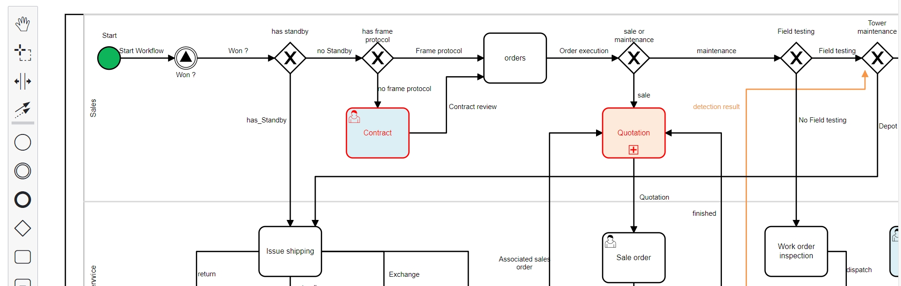

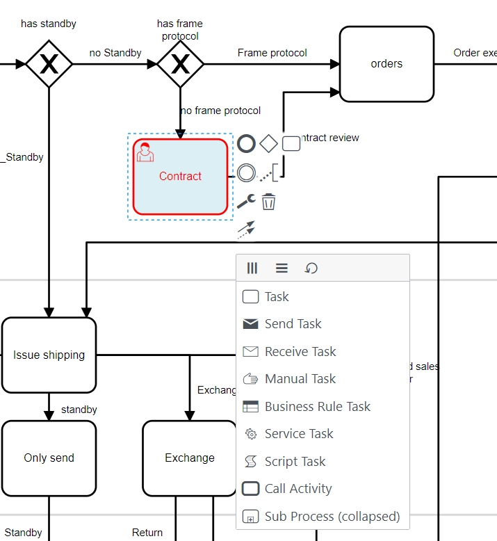

2. The workflow of or-sign approval, counter-sign approval, notification, designated node rollback, etc. will be improved.
|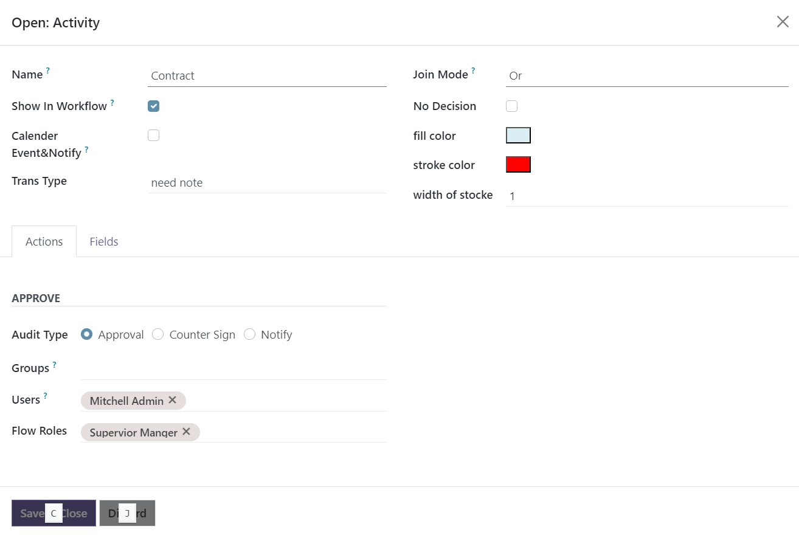|

3. Flexible workflow role definition supports dynamic calculation of workflow roles based on the identity of the approval node.
4. Support sub-process definition
|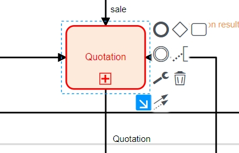|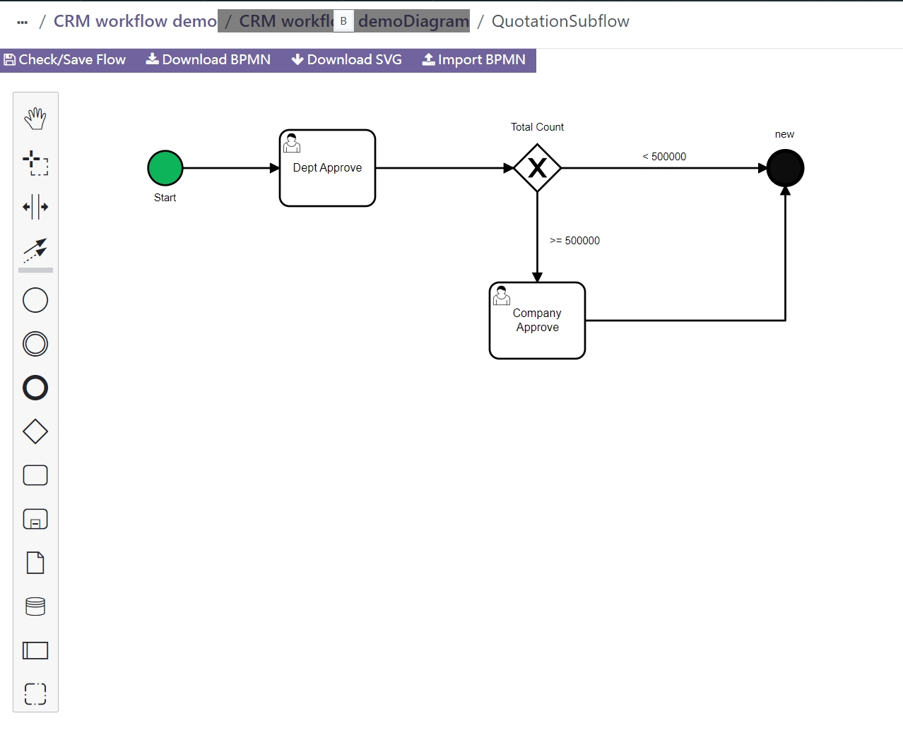

# ODOO Workflow Package
ODOO workflow Package has four addons. The release is a package, and the **source codes of the four addons are in the <u>Widgets</u> directory**.  

just_todo: for workflow task executor to do tasks or approve

just_widget_colorpicker: for workflow node and  trans set color and board

just_workflow_bpmn,: using bmpn.io for the diagramming part,

just_workflow_engine: A custom development, for Drive Workflow Execution,

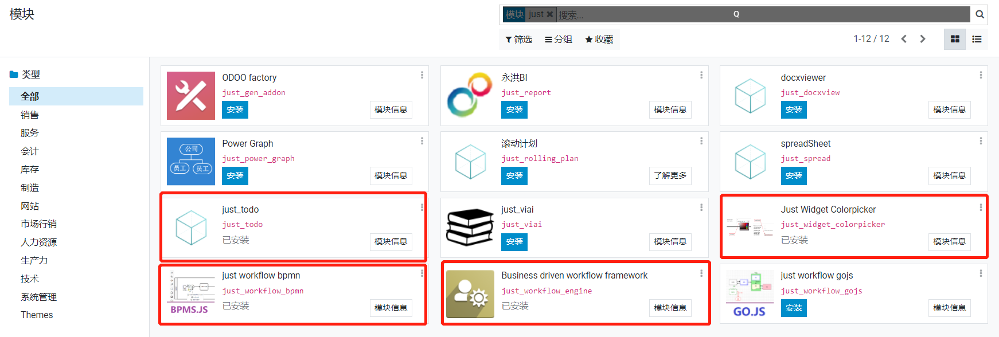

## Demo and Video
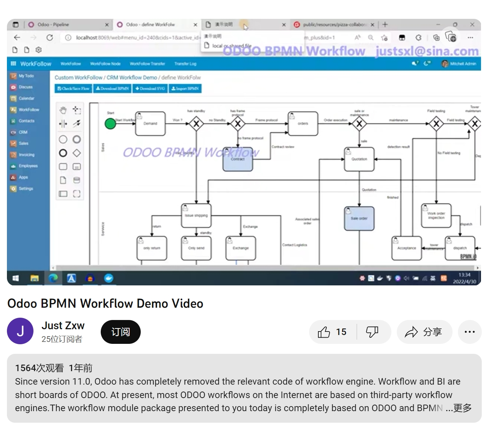
[ODOO BPMN Workflow DEMO Video English](https://www.youtube.com/watch?v=YIDt_coa4IY&t=0s)
[ODOO BPMN Workflow DEMO Video 中文](https://www.youtube.com/watch?v=N8IUQh2t3Hg&t=0s)
## Just Widget Colorpicker 
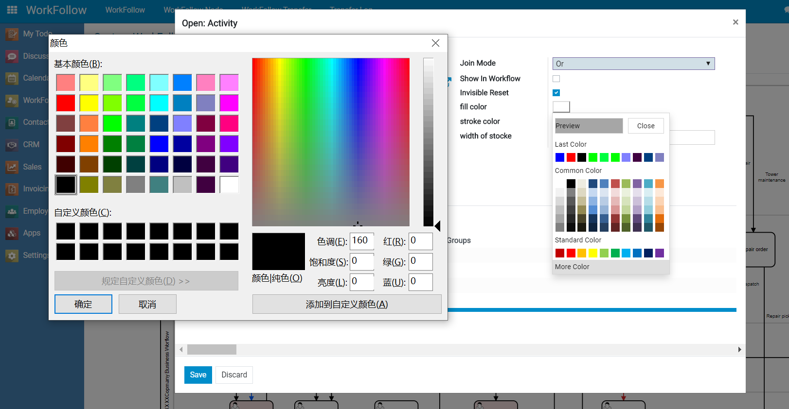

## just_workflow_bpmn
-Based on BPMN2 0's graphical custom workflow module assists in generating workflow model definitions, flexible workflow nodes and action settings, and complements the short board of odoo's lack of workflow.

-基于BPMN2.0 的图形化自定义工作流模块，辅助生成工作流模型定义，灵活的流程节点及动作设置，补充Odoo缺少工作流的短板。

-The update and application of workflow does not affect the original business definition. After the workflow is activated, the approval button, node display and workflow action are automatically generated. After completion, the adjustment and definition of business workflow workflow can be completed without development.

-工作流更新及应用，不影响原有业务定义，流程激活后，审批按钮和节点显示以及流程动作自动生成，完成无需开发即可完成业务工作流流程的调整及定义

-It supports countersigning (multiple people are required to approve at the same time), countersigning, workflow selection (different next nodes are automatically selected according to different conditions), re initiation and termination, multi branch execution, python method triggering, seamless connection with the internal functions of documents, log recording, approval comments, Calendar Reminder, and the workflow is driven by to-do tasks.

-支持会签（需要多人同时审批），加签，支持流程选择（根据不同条件，自动选择不同的下个节点） 支持重新发起及终止，支持多分支执行，支持python方法触发，可与单据的内部功能无缝衔接，支持日志记录，支持审批意见批示 ,支持日历提醒，流程以待办任务方式驱动。

-Flexible approval permission settings. The approval button can set specific users or user groups. workflow node form workflowing can be read-only or edited according to personnel role settings.
-灵活的审批权限设置,审批按钮可以设置具体的用户,也可以设置用户组。流程节点表单处理可以根据人员角色设置只读或编辑。

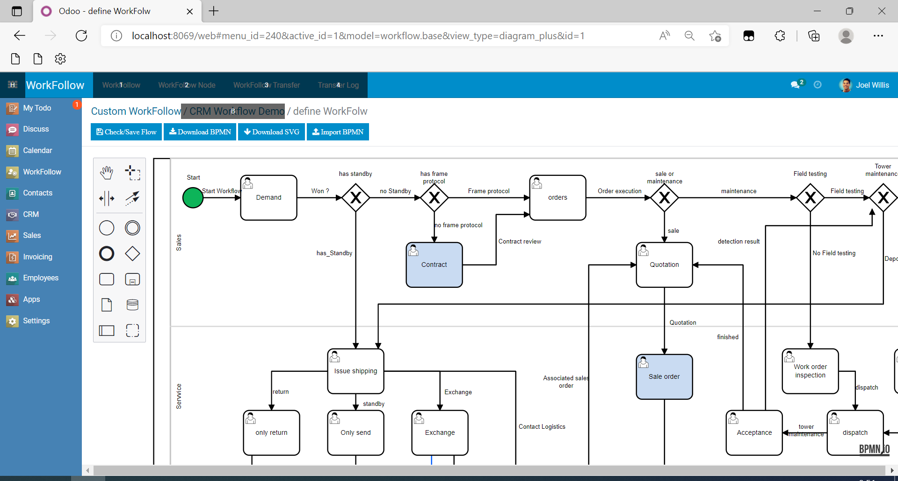

## just_workflow_engine

-Works perfectly with any model.

-Works with Odoo community & enterprise edition.

-Build workflow via State Diagram view.

-Control fields & buttons attributes per state.

-Control fields visibility depending on user and/or security group.

-Buttons can execute different type of actions, like (Link Triggers, Server Actions, Window Actions, Python Code)

##### 主要特点：

-适用于任何模型。

-ODOO社区和企业版均可用。

-通过BPMN流程图构建工作流。

-可以单独控制字段和按钮属性。

-用户或角色组控制字段可见性。

-按钮可以执行不同类型的操作，比如（链接触发器、服务器操作、窗口操作、Python代码）

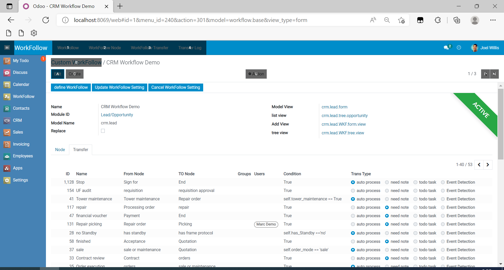

## just_todo
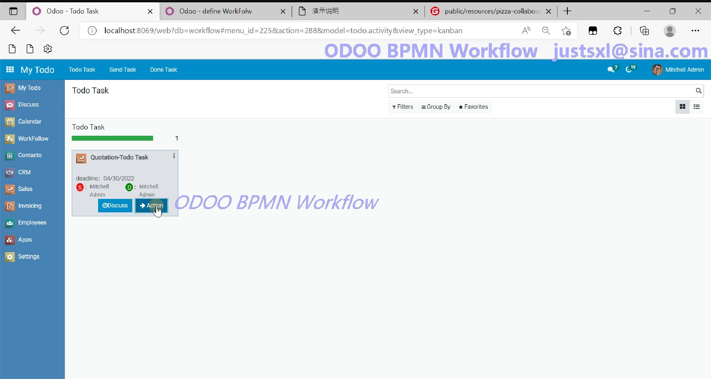

## Contact Information 

- Skype: justsxl@sina.com 
- Email: justsxl@sina.com 
- [QQ Immediately QQ立刻联系](tencent://message/?uin=314015700)